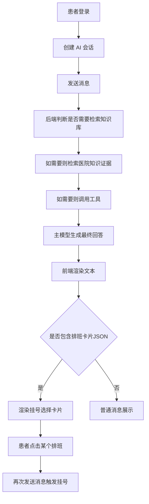
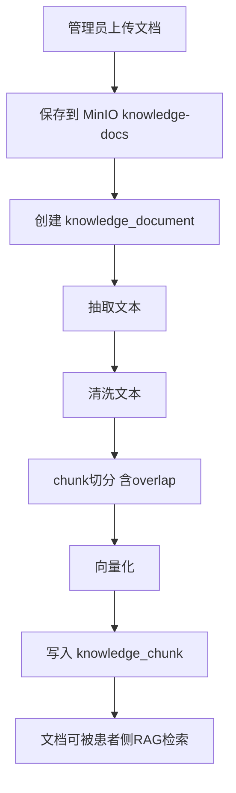

# 患者侧 AI 助诊与知识库前后端对接说明

## 1. 文档目标

这份文档给前端同学和联调同学使用，目标是讲清楚当前患者侧 AI 助诊的：

- 页面功能范围
- 接口清单
- 请求/响应格式
- 前后端交互流程
- 需要前端特殊处理的返回协议
- 当前已经完成的部分
- 当前还没有做的接口

这份文档聚焦两个模块：

1. 患者侧统一 AI 会话
2. 管理端知识库文档上传与状态流转


## 2. 当前状态结论

当前后端这块已经不是“纯聊天 Demo”，而是已经接成了一个最小可用的“证据优先”统一 RAG Agent。

已完成：

- 患者在一个统一会话中进行问答、导诊、挂号协同
- 后端可根据问题自动决定是否检索医院知识库
- 检索结果会作为证据注入模型回答
- 工具调用仍然可用：
  - `queryDepartment`
  - `querySchedule`
  - `bookRegistration`
- 管理端可以上传知识文档，后端会自动入库、清洗、切分、向量化

还没做完：

- 患者侧暂无“查询历史会话列表 / 查询消息历史”接口
- 管理端暂无“知识文档分页列表 / 重建索引 / 删除文档”接口
- 前端还没做，所以当前主要差的是前后端联调和交互落地


## 3. 和现有总文档相比，AI 相关改动点

现有文档：

- `.md/前端三端功能与接口梳理.md`

其中 AI 相关内容目前只写了：

- `POST /api/ai/chat/sessions`
- `POST /api/ai/chat/sessions/{sessionNo}/messages`

这个描述现在已经不够了，原因如下：

1. 现在 AI 聊天不只是普通 LLM 对话，而是统一 RAG Agent
2. 现在增加了管理端知识库接口
3. AI 回复中存在前端要解析的特殊 JSON 卡片协议
4. `sessionType` 现在只是标签，不再是主流程切分轴心
5. 现在聊天回答会优先依据医院知识证据和工具结果


## 4. 整体业务流程

### 4.1 患者侧主流程



### 4.2 管理端知识库流程




## 5. 统一响应格式

所有接口都包在统一响应对象里：

```json
{
  "code": 200,
  "message": "success",
  "data": {},
  "timestamp": "2026-07-06T10:30:00"
}
```

说明：

- `code = 200` 表示成功
- 非 `200` 表示业务错误或鉴权错误
- 前端不要直接假设 HTTP 200 就一定业务成功，必须同时看 `code`


## 6. 鉴权要求

### 6.1 患者侧 AI 接口

要求：

- 已登录
- 当前账号必须是患者账号

请求头：

```text
Authorization: Bearer {accessToken}
```

如果不是患者账号，后端会返回错误。

### 6.2 管理端知识库接口

要求：

- 已登录
- 角色必须是 `ADMIN` 或 `MANAGEMENT`


## 7. 患者侧接口

## 7.1 创建 AI 会话

接口：

```text
POST /api/ai/chat/sessions
```

请求体：

```json
{
  "registrationId": 12345,
  "sessionType": "PATIENT_AGENT"
}
```

字段说明：

- `registrationId`
  - 可为空
  - 如果本次 AI 助诊是围绕某次挂号进行，可传
- `sessionType`
  - 当前仍保留
  - 但它现在只是“标签”
  - 不再作为问答 / 导诊 / 挂号的主流程分叉条件
  - 前端建议固定传：`PATIENT_AGENT`

成功返回示例：

```json
{
  "code": 200,
  "message": "success",
  "data": {
    "sessionNo": "CHATe3b6c11d2b6f4e25a0d8a72d5c692001",
    "registrationId": 12345,
    "sessionType": "PATIENT_AGENT",
    "status": "ENABLED",
    "startedAt": "2026-07-06T10:35:00"
  },
  "timestamp": "2026-07-06T10:35:00"
}
```

前端处理建议：

1. 进入 AI 页面时先创建一次会话
2. 保存 `sessionNo`
3. 之后发送消息都用这个 `sessionNo`


## 7.2 发送消息

接口：

```text
POST /api/ai/chat/sessions/{sessionNo}/messages
```

请求体：

```json
{
  "content": "我第一次来，要怎么挂号，要带什么材料？"
}
```

成功返回示例：

```json
{
  "code": 200,
  "message": "success",
  "data": "如果您是初诊，一般需要先完成建档，并准备身份证、医保卡等材料。若您愿意，我可以继续帮您推荐科室并查询可挂号的排班。",
  "timestamp": "2026-07-06T10:36:00"
}
```

说明：

- 当前 `data` 是一个字符串
- 不是结构化消息数组
- 前端当前需要把它当成“单条 AI 回复文本”处理


## 7.3 AI 回复中的特殊协议：排班卡片 JSON

当 AI 已经确定科室，并查询到了可挂号排班后，回复末尾可能附带一个 fenced code block：

```json
{
  "type": "SCHEDULE_OPTIONS",
  "options": [
    {
      "scheduleId": 101,
      "scheduleDate": "2026-07-08",
      "doctorName": "张主任",
      "timeSlot": "上午",
      "remainQuota": 5
    },
    {
      "scheduleId": 102,
      "scheduleDate": "2026-07-08",
      "doctorName": "李医生",
      "timeSlot": "下午",
      "remainQuota": 10
    }
  ]
}
```

注意：

- 这个 JSON 不是单独字段返回
- 它是嵌在 AI 文本里的
- 前端需要自己从字符串中识别并解析

前端建议策略：

1. 先展示完整文本
2. 再尝试扫描是否包含 ```` ```json ... ``` ````
3. 如果 JSON 的 `type === "SCHEDULE_OPTIONS"`，就渲染排班卡片

建议渲染字段：

- 日期 `scheduleDate`
- 医生姓名 `doctorName`
- 时段 `timeSlot`
- 剩余号源 `remainQuota`
- 隐式主键 `scheduleId`

推荐交互：

- 先从 `options` 中按 `scheduleDate` 去重，渲染日期选择。
- 用户选中某个日期后，只展示该日期下的排班。
- 在日期内再按 `timeSlot` 提供上午/下午/晚上筛选。
- 卡片点击时仍使用 `scheduleId` 作为唯一提交值。

点击卡片后的推荐行为：

- 不直接本地宣布“挂号成功”
- 让前端把患者选择转成一条新消息发回后端，例如：

```json
{
  "content": "我要预约排班ID为101的号"
}
```

然后让后端继续通过 AI + tool 完成真实挂号。


## 7.4 患者侧推荐页面与交互

### 页面 1：AI 助诊聊天页

建议功能：

- 顶部展示会话状态
- 消息列表
- 输入框
- “快捷问题”按钮
- 卡片区

快捷问题建议：

- 我第一次来怎么挂号？
- 初诊要带什么材料？
- 头疼应该挂什么科？
- 做检查前要注意什么？

### 页面 2：挂号排班卡片区

触发时机：

- AI 回复中带 `SCHEDULE_OPTIONS`

卡片行为：

- 展示医生和剩余号源
- 点击后发消息给后端
- 不直接绕过聊天接口单独调用挂号接口


## 8. 管理端知识库接口

## 8.1 上传知识文档

接口：

```text
POST /api/admin/ai/knowledge/documents/upload
```

请求类型：

```text
multipart/form-data
```

表单字段：

- `file`: 文件
- `title`: 文档标题
- `knowledgeType`: 知识类别
- `departmentId`: 可选，科室 ID
- `tags`: 可选，标签字符串
- `publishNow`: 可选，默认 `false`

支持文件格式：

- `pdf`
- `docx`
- `md`
- `txt`

上传示例：

```text
file = 初诊挂号流程.md
title = 初诊挂号流程说明
knowledgeType = REGISTRATION_PROCESS
departmentId = 12
tags = 初诊,挂号,材料
publishNow = true
```

成功返回示例：

```json
{
  "code": 200,
  "message": "success",
  "data": {
    "id": 1001,
    "docNo": "KNOW8f0f5f7f2d7b4c3ca714f77d9c5b1001",
    "title": "初诊挂号流程说明",
    "knowledgeType": "REGISTRATION_PROCESS",
    "departmentId": 12,
    "tags": "初诊,挂号,材料",
    "status": "PUBLISHED",
    "parserStatus": "EMBEDDED",
    "chunkCount": 6
  },
  "timestamp": "2026-07-06T10:40:00"
}
```


## 8.2 发布知识文档

接口：

```text
POST /api/admin/ai/knowledge/documents/{documentId}/publish
```

作用：

- 把文档状态切成 `PUBLISHED`
- 允许患者侧检索使用


## 8.3 下线知识文档

接口：

```text
POST /api/admin/ai/knowledge/documents/{documentId}/offline
```

作用：

- 把文档状态切成 `OFFLINE`
- 后续患者侧不应该再命中这份知识


## 9. 推荐的知识类别枚举

当前后端已经按这些类别在路由和检索里使用，前端管理端建议直接用这些值做下拉框：

- `REGISTRATION_PROCESS`
- `VISIT_NOTICE`
- `DEPARTMENT_INFO`
- `VISIT_PREPARATION`
- `EXAM_NOTICE`
- `FAQ`

可理解为：

- `REGISTRATION_PROCESS`: 挂号流程
- `VISIT_NOTICE`: 就诊须知
- `DEPARTMENT_INFO`: 科室说明
- `VISIT_PREPARATION`: 初诊/复诊材料准备
- `EXAM_NOTICE`: 检查前注意事项
- `FAQ`: 常见问题


## 10. 知识文档状态与解析状态

### 10.1 status

- `DRAFT`
- `PUBLISHED`
- `OFFLINE`

含义：

- `DRAFT`: 草稿，已上传但未正式发布
- `PUBLISHED`: 已发布，可用于患者侧 RAG
- `OFFLINE`: 已下线，不再用于患者侧检索

### 10.2 parserStatus

- `PENDING`
- `RUNNING`
- `EMBEDDED`
- `FAILED`

含义：

- `PENDING`: 等待解析
- `RUNNING`: 正在解析/切分/向量化
- `EMBEDDED`: 已完成向量化，可用于检索
- `FAILED`: 入库失败


## 11. 前端当前必须知道的限制

### 11.1 当前没有消息历史接口

当前只有：

- 创建会话
- 发送消息

当前没有：

- 查询消息列表
- 查询历史会话列表
- 删除会话

所以现阶段前端建议：

1. 进入 AI 页面创建一个新会话
2. 本次页面内的消息先存在前端本地状态里
3. 页面刷新后，如果没做本地缓存，会话展示会丢失

### 11.2 当前没有知识库分页查询接口

当前管理端只有：

- 上传
- 发布
- 下线

还没有：

- 分页列表
- 文档详情
- 重新向量化
- 删除

所以如果要先做管理端页面，建议第一版只做“上传页 + 成功提示”，不要一开始就做完整知识库列表后台。


## 12. 前端推荐联调顺序

### 第一步：管理员上传一份知识文档

建议内容：

- 初诊挂号流程
- 初诊材料说明
- 检查前注意事项

验证目标：

- 上传接口成功
- 后端能返回 `parserStatus`
- 返回 `chunkCount > 0`

### 第二步：患者创建 AI 会话

验证目标：

- 能拿到 `sessionNo`

### 第三步：患者连续提问

建议问题：

- 我第一次来怎么挂号？
- 初诊要带什么材料？
- 头疼应该挂什么科？
- 做检查前有什么注意事项？

验证目标：

- 回答明显带医院流程信息
- 不乱编“本院规定”
- 需要导诊时能自然继续

### 第四步：验证排班卡片

建议问题：

- 我头疼，想挂号，你帮我推荐科室并看下排班

验证目标：

- AI 文本末尾能带 `SCHEDULE_OPTIONS`
- 前端能正确渲染按钮卡片

### 第五步：验证挂号执行

操作：

- 点击卡片
- 前端发送新消息，例如：
  - `我要预约排班ID为101的号`

验证目标：

- AI 最终回复真实挂号结果


## 13. 这次最重要的前端认知变化

前端同学最需要记住这几点：

1. 这已经不是“普通聊天机器人”
2. 患者侧 AI 是统一会话，不按 `sessionType` 切问答/导诊/挂号
3. 聊天回复里可能携带结构化 JSON 卡片
4. 管理端已经有知识库上传接口，不只是患者聊天接口
5. 当前最主要的前后端工作是联调，不是继续猜接口


## 14. 建议后续补充接口

如果前端开始正式做页面，后端下一批最值得补的接口是：

1. 患者侧：
   - 查询会话列表
   - 查询会话消息历史

2. 管理端知识库：
   - 分页查询文档列表
   - 查询单个文档详情
   - 手动重建向量索引
   - 删除/作废文档

3. AI 结果结构化：
   - 把 `SCHEDULE_OPTIONS` 从“嵌入文本”升级成独立字段

